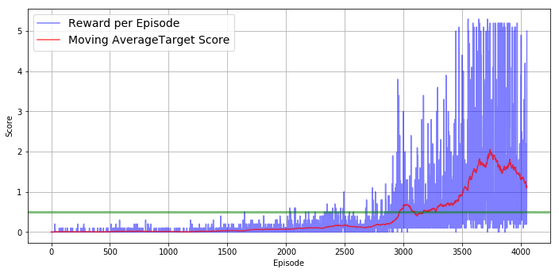

# Introduction

In order to solve the environment, two RL agents to play tennis. As in real tennis, the goal of each player is to keep the ball in play.
In order to solve the environment, two RL agents to play tennis. As in real tennis, the goal of each player is to keep the ball in play. 
In this environment, two agents control rackets to bounce a ball over a net. If an agent hits the ball over the net, it receives a reward of +0.1. If an agent lets a ball hit the ground or hits the ball out of bounds, it receives a reward of -0.01. Thus, the goal of each agent is to keep the ball in play.

The task is episodic, and in order to solve the environment, your agents must get an average score of +0.5 (over 100 consecutive episodes, after taking the maximum over both agents). 

## Global architecture

- The Tennis environment has 2 different agents, whereas the Navigation project had only a single agent.

- I also needed to pick which algorithms were the most suitable for this environment.

The action space is continuous, which allows each agent to execute more complex actions, whilst the agent in the first project was limited to 4 discrete actions.
Given this parameter, the value-based (Deep Q-Network) method I used for the first project would not work as well. That's why I needed to use policy-based methods.

## MADDPG

In [Continuous Control with Deep Reinforcement Learning](https://arxiv.org/pdf/1509.02971.pdf), written by researchers at Google DeepMind, they highlight that Deep Deterministic Policy Gradient (DDPG) can be seen as an extension of Deep Q-learning to continuous tasks. That's why I picked this "Actor-Critic" algorithm.

With a policy-based approach, the Actor learns how to act by directly estimating the optimal policy and maximizing reward through gradient ascent, while the Critic learns how to estimate the value of different state-action pairs with a value-based approach.

To make this algorithm suitable for the multiple competitive agents in the Tennis environment, I implemented components discussed in this paper, [Multi-Agent Actor-Critic for Mixed Cooperative-Competitive Environments](https://papers.nips.cc/paper/7217-multi-agent-actor-critic-for-mixed-cooperative-competitive-environments.pdf), by Lowe and Wu.

##  Local and target networks 

Moreover, I used local and target networks to improve stability.

## Ornstein-Uhlenbeck

I've also used the Ornstein-Uhlenbeck process (as suggested in the previously mentioned paper by Google DeepMind), which adds a certain amount of noise to the action values at each timestep and therefore allows the agents to explore the action space.

## Gradient clipping

Finally, after many failed trainings, I've decided to use gradient clipping, implemented in `Agent.learn()`, within `maddpg_agent.py`. This method sets a limit on the size of the parameter updates, and stops them from growing too fast.

## Learning Interval
Initially the agent only performed a single learning iteration per episode. In general, I found that performing multiple learning passes per episode yielded faster convergence and higher scores.

# Hyperparameters

## Networks

In `model.py`, you can find the (almost similar) architectures of the Actor and the Critic :
- input_size = 2*state_size = 2*24 = 48
- 2 hidden fully-connected layers with 400 and 300 nodes
- ReLu activation function was used between fc1 and fc2

## Agent's hyperparameters

Many tests were run but the final choice of the hyperparameters was :

- `BUFFER_SIZE` = int(1e6) : replay buffer size
- `BATCH_SIZE` = 128 : minibatch size
- `GAMMA` = 0.99 : discount factor
- `TAU` = 1e-3 : for soft update of target parameters
- `LR` = 5e-4 : learning rate
- `LR_ACTOR` = 1e-3         # learning rate of the actor
- `LR_CRITIC` = 1e-3        # learning rate of the critic
- `WEIGHT_DECAY` = 0        # L2 weight decay
- `OU_SIGMA` = 0.2          # Ornstein-Uhlenbeck noise parameter, volatility
- `OU_THETA` = 0.15         # Ornstein-Uhlenbeck noise parameter, speed of mean reversion
- `EPS_START` = 5.0         # initial value for epsilon in noise decay process in Agent.act()
- `EPS_EP_END` = 1000       # episode to end the noise decay process
- `EPS_FINAL` = 1e-6        # final value for epsilon after decay
- `LEARN_EVERY` = 20        # learning interval (no. of episodes)
- `LEARN_NUM` = 10          # number of passes per learning step

# Results

The agent reached its goal (moving average >= 0.5 over 100 consecutive episodes) after 2967 episodes.
I let the training continue and the moving average score peaked, reaching 1.921, before going down over 500 consecutive episodes, thus stopping the training.

The training details are shown below.

# Future work

- I'd like to tackle the training instability to make it more reproducible.
- A first step toward this goal would be the addition of Batch Normalization in the neural networks, as I know it increased the perfomance of the DDPG agent in the second project.
